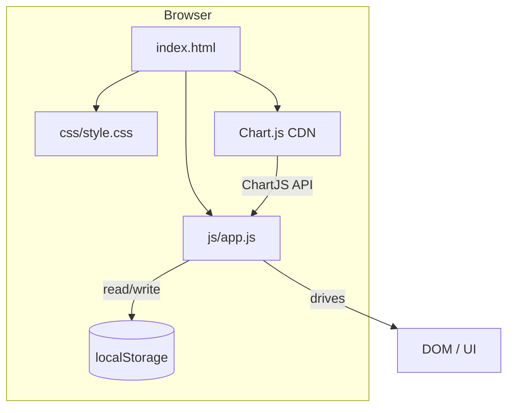
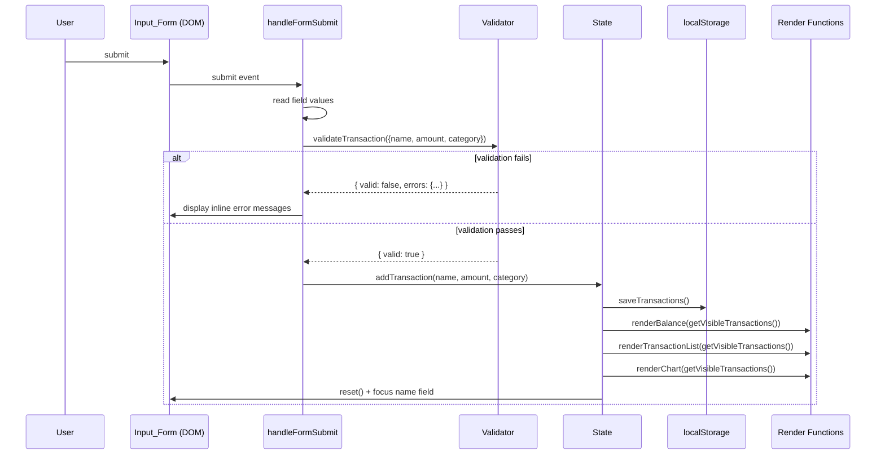

# Design Document — Expense & Budget Visualizer

## Overview

The Expense & Budget Visualizer is a fully client-side, single-page web application. It runs directly from a local file system with no build step, no backend, and no external services beyond Chart.js loaded from a CDN.

The application lets users record personal expense transactions, organize them by category, visualize spending distribution with a pie chart, filter by calendar month, and toggle between dark and light themes. All state is persisted in the browser's `localStorage` API.

**Key constraints:**
- Three deliverable files: `index.html`, `css/style.css`, `js/app.js`
- No frameworks, no transpilers, no module bundlers
- Chart.js loaded via CDN (`<script src="https://cdn.jsdelivr.net/npm/chart.js">`)
- Must work as `file://` and from any static HTTP server
- Must run without errors in current Chrome, Firefox, Edge, and Safari

---

## Architecture

### File Structure

```
project-root/
├── index.html          ← single HTML file, markup skeleton + CDN script tag
├── css/
│   └── style.css       ← all styles, CSS custom properties for theming
└── js/
    └── app.js          ← all application logic, organized into logical sections
```

### High-Level Architecture



The architecture is deliberately flat. There is no framework routing, no component lifecycle, and no reactive data layer. All UI updates are triggered explicitly by functions in `app.js` after a state mutation:

```
User Action → Event Handler → Validate / Mutate State → Persist to localStorage → Re-render affected UI regions
```

State lives in two module-level variables inside `app.js`:
- `state.transactions` — array of `Transaction` objects (the source of truth)
- `state.categories` — array of category name strings (built-in + custom)

All render functions read from `state` and write to the DOM; they are pure side-effect functions that produce no return value and read nothing from the DOM.

---

## Components and Interfaces

### UI Layout and Component Hierarchy

```
<body data-theme="light|dark">
  ├── <header>
  │     ├── App title
  │     └── <button id="theme-toggle">  ← Theme_Toggle
  │
  ├── <main>
  │     ├── <!-- Left column -->
  │     │     ├── <section id="balance-section">
  │     │     │     └── <span id="balance-display">  ← Balance_Display
  │     │     │
  │     │     ├── <section id="form-section">
  │     │     │     └── <form id="transaction-form">  ← Input_Form
  │     │     │           ├── <input id="item-name">
  │     │     │           ├── <input id="item-amount">
  │     │     │           ├── <select id="category-select">
  │     │     │           └── <button type="submit">
  │     │     │
  │     │     ├── <section id="category-section">
  │     │     │     └── <!-- Category_Manager -->
  │     │     │           ├── <input id="new-category-input">
  │     │     │           └── <button id="add-category-btn">
  │     │     │
  │     │     └── <section id="filter-section">
  │     │           └── <!-- Monthly_Summary controls -->
  │     │                 ├── <input id="month-filter" type="month">
  │     │                 └── <button id="clear-filter-btn">
  │     │
  │     └── <!-- Right column -->
  │           ├── <section id="chart-section">
  │           │     └── <canvas id="spending-chart">  ← Pie_Chart
  │           │
  │           └── <section id="list-section">
  │                 └── <ul id="transaction-list">  ← Transaction_List
  │                       ├── <li> …transaction item… </li>
  │                       └── <!-- or empty-state message -->
  │
  └── <div id="toast-container">  ← non-blocking warning/error toasts
```

### Component Responsibilities

| Component | DOM Anchor | Responsibility |
|---|---|---|
| Input_Form | `#transaction-form` | Collect and submit new transaction data |
| Validator | (no DOM) | Pure JS validation functions; returns error objects |
| Transaction_List | `#transaction-list` | Render sorted, filtered transaction rows with delete controls |
| Balance_Display | `#balance-display` | Show sum of visible transactions |
| Pie_Chart | `#spending-chart` | Chart.js doughnut/pie render of category distribution |
| Category_Manager | `#category-section` | Add and persist custom categories; populate dropdown |
| Monthly_Summary | `#filter-section` | Month/year picker; drives active filter state |
| Theme_Toggle | `#theme-toggle` | Toggle `data-theme` attribute on `<body>` |
| Toast / Error layer | `#toast-container` | Non-blocking error and warning messages |

### JavaScript Logical Sections in `app.js`

The single `app.js` file is organized into clearly labelled sections (each delimited by a comment block):

```
// ─── 1. CONSTANTS & CONFIG ──────────────────────────────────────────────────
// ─── 2. STATE ────────────────────────────────────────────────────────────────
// ─── 3. LOCAL STORAGE ────────────────────────────────────────────────────────
// ─── 4. VALIDATOR ────────────────────────────────────────────────────────────
// ─── 5. TRANSACTION OPERATIONS ───────────────────────────────────────────────
// ─── 6. CATEGORY OPERATIONS ──────────────────────────────────────────────────
// ─── 7. FILTER STATE ─────────────────────────────────────────────────────────
// ─── 8. RENDER: BALANCE DISPLAY ──────────────────────────────────────────────
// ─── 9. RENDER: TRANSACTION LIST ─────────────────────────────────────────────
// ─── 10. RENDER: PIE CHART ───────────────────────────────────────────────────
// ─── 11. RENDER: CATEGORY DROPDOWN ───────────────────────────────────────────
// ─── 12. THEME ──────────────────────────��────────────────────────────────────
// ─── 13. EVENT HANDLERS ──────────────────────────────────────────────────────
// ─── 14. INITIALISATION ──────────────────────────────────────────────────────
```

**Section responsibilities:**

**1. Constants & Config** — Storage keys, built-in category list, validation bounds, color palette array for the chart.

**2. State** — Single mutable `state` object:
```js
const state = {
  transactions: [],   // Transaction[]
  categories: [],     // string[]
  activeFilter: null, // { year: number, month: number } | null
  theme: 'light',     // 'light' | 'dark'
  chartInstance: null // Chart.js instance or null
};
```

**3. Local Storage** — Four functions, each with try/catch:
- `loadFromStorage()` → reads and parses all three storage keys on startup
- `saveTransactions()` → serializes `state.transactions` and writes to `ebv_transactions`
- `saveCategories()` → serializes `state.categories` and writes to `ebv_categories`
- `saveTheme()` → writes `state.theme` to `ebv_theme`

**4. Validator** — Pure functions, no DOM access:
- `validateTransaction({ name, amount, category })` → returns `{ valid: boolean, errors: { name?, amount?, category? } }`
- `validateCategory({ name, existing })` → returns `{ valid: boolean, error?: string }`

**5. Transaction Operations** — Mutates `state.transactions`, calls storage, calls render:
- `addTransaction(name, amount, category)` → creates Transaction, pushes to state, saves, renders all
- `deleteTransaction(id)` → removes from state, saves, renders all

**6. Category Operations** — Mutates `state.categories`, calls storage, calls dropdown render:
- `initCategories()` → merges built-ins with loaded custom categories
- `addCategory(name)` → validates, pushes to state, saves, renders dropdown

**7. Filter State** — Manages `state.activeFilter`:
- `setMonthFilter(year, month)` → sets filter, calls render
- `clearMonthFilter()` → nulls filter, calls render
- `getVisibleTransactions()` → returns `state.transactions` filtered by `state.activeFilter`

**8–11. Render functions** — Called after any state mutation; each reads `state` (or receives a list argument) and writes to the DOM:
- `renderBalance(transactions)` → sums amounts, formats, sets text content
- `renderTransactionList(transactions)` → builds `<li>` elements, handles empty state
- `renderChart(transactions)` → computes per-category totals, calls `chart.update()` or `chart.destroy()+new Chart()`
- `renderCategoryDropdown()` → rebuilds `<option>` list from `state.categories`

**12. Theme** — CSS custom property–driven:
- `applyTheme(theme)` → sets `document.body.dataset.theme`, updates `state.theme`, saves to storage
- `toggleTheme()` → flips between `'light'` and `'dark'`

**13. Event Handlers** — Wire DOM events to operations:
- Form `submit` → `handleFormSubmit`
- Delete button `click` (delegated on `#transaction-list`) → `handleDeleteClick`
- Add-category button `click` → `handleAddCategory`
- Month filter `change` → `handleFilterChange`
- Clear filter `click` → `handleClearFilter`
- Theme toggle `click` → `toggleTheme`

**14. Initialisation** — Entry point called on `DOMContentLoaded`:
```js
function init() {
  loadFromStorage();     // populates state from localStorage
  initCategories();      // merges built-ins + custom
  applyTheme(state.theme);
  renderCategoryDropdown();
  const visible = getVisibleTransactions();
  renderBalance(visible);
  renderTransactionList(visible);
  renderChart(visible);
  bindEventHandlers();
}
document.addEventListener('DOMContentLoaded', init);
```

### Event Flow: Form Submit → Validate → Store → Render



### Chart.js Integration

The chart is a **doughnut chart** (visually identical to a pie, but with a center hole that can show a total label). This is the recommended Chart.js type for spending distribution.

```js
// Initial chart creation (called once in init, then updated in place)
state.chartInstance = new Chart(
  document.getElementById('spending-chart'),
  {
    type: 'doughnut',
    data: {
      labels: [],       // populated by renderChart()
      datasets: [{ data: [], backgroundColor: [] }]
    },
    options: {
      responsive: true,
      plugins: {
        legend: { position: 'bottom' },
        tooltip: {
          callbacks: {
            label: (ctx) => `${ctx.label}: ${ctx.parsed.toFixed(1)}%`
          }
        }
      }
    }
  }
);
```

`renderChart(transactions)`:
1. Compute per-category sums from `transactions`
2. Filter to categories with sum > 0
3. Compute percentage of total for each category (round to 1 decimal)
4. If no data → hide canvas, show placeholder element; return
5. Otherwise show canvas, hide placeholder
6. Assign colors from the `CHART_COLORS` palette, cycling if needed, ensuring no two adjacent entries share the same color
7. Update `state.chartInstance.data.labels`, `data.datasets[0].data`, `data.datasets[0].backgroundColor`
8. Call `state.chartInstance.update()`

The chart instance is created once and updated in place to avoid flicker and preserve Chart.js animation.

---

## Data Models

### Transaction Object

```js
/**
 * @typedef {Object} Transaction
 * @property {string} id        - UUID v4 generated with crypto.randomUUID()
 * @property {string} name      - Item name, max 100 characters, trimmed
 * @property {number} amount    - Positive number, 0.01–999999999.99 (stored as JS number)
 * @property {string} category  - Category name string (must exist in state.categories)
 * @property {string} timestamp - ISO 8601 datetime string (new Date().toISOString())
 */
```

Example:
```json
{
  "id": "f47ac10b-58cc-4372-a567-0e02b2c3d479",
  "name": "Lunch at warung",
  "amount": 35000,
  "category": "Food",
  "timestamp": "2025-09-14T11:30:00.000Z"
}
```

### Storage Keys and Schemas

| Key | Type | Schema |
|---|---|---|
| `ebv_transactions` | JSON string | `Transaction[]` — full array serialized as JSON |
| `ebv_categories` | JSON string | `string[]` — custom category names only (built-ins are never persisted; they are injected at runtime) |
| `ebv_theme` | JSON string | `"light"` or `"dark"` |

**Design note:** Built-in categories (`"Food"`, `"Transport"`, `"Fun"`) are declared in the `BUILT_IN_CATEGORIES` constant and merged into `state.categories` at startup. They are not written to `ebv_categories`, ensuring they always appear even if the user clears storage manually.

### Validation Rules

| Field | Rule |
|---|---|
| `name` | Non-empty after trimming; length ≤ 100 characters |
| `amount` | Parsable as a finite number; in range [0.01, 999999999.99] |
| `category` | Not null/undefined/empty; must exist in the current category list |
| custom category `name` | Non-empty after trimming; length ≤ 50 characters; case-insensitive unique among existing categories |

---

## Theme Implementation

The dark/light theme is implemented entirely through CSS custom properties on the `:root` element, overridden by the `[data-theme="dark"]` selector on `<body>`.

```css
/* css/style.css */
:root {
  --color-bg: #f9fafb;
  --color-surface: #ffffff;
  --color-text-primary: #111827;
  --color-text-secondary: #6b7280;
  --color-border: #e5e7eb;
  --color-accent: #6366f1;
  --color-danger: #ef4444;
}

[data-theme="dark"] {
  --color-bg: #111827;
  --color-surface: #1f2937;
  --color-text-primary: #f9fafb;
  --color-text-secondary: #9ca3af;
  --color-border: #374151;
  --color-accent: #818cf8;
  --color-danger: #f87171;
}
```

All colors in the stylesheet reference only these custom properties — never hardcoded hex values. Theme switching is therefore a single DOM write:

```js
document.body.dataset.theme = theme; // 'light' or 'dark'
```

This is sufficient to re-cascade all CSS variables across the entire UI within a single paint frame, meeting the 100ms requirement. Chart.js canvas colors (legend text, tooltip background) are read from computed styles after the theme switch via `getComputedStyle(document.body)`.

---

## Monthly Filter Logic

`state.activeFilter` holds either `null` (no filter) or `{ year: number, month: number }` (1-indexed month).

```js
function getVisibleTransactions() {
  if (!state.activeFilter) return [...state.transactions];
  const { year, month } = state.activeFilter;
  return state.transactions.filter(tx => {
    const d = new Date(tx.timestamp);
    return d.getFullYear() === year && (d.getMonth() + 1) === month;
  });
}
```

The month/year selector uses `<input type="month">` (value format: `"YYYY-MM"`). On change, the handler parses the value and calls `setMonthFilter(year, month)`, which updates `state.activeFilter` then calls all render functions with the new visible set.

The selector's `min` attribute is computed dynamically on load and on each transaction addition by scanning `state.transactions` for the earliest timestamp. Its `max` is always the current month.

---

## Custom Category Management

```
User types name → clicks "Add Category"
  → validateCategory({ name, existing: state.categories })
      ← { valid: false, error: "..." }  → display inline error, stop
      ← { valid: true }
  → state.categories.push(name.trim())
  → saveCategories()
  → renderCategoryDropdown()
```

Duplicate check in `validateCategory`:
```js
const duplicate = existing.some(
  c => c.toLowerCase() === name.trim().toLowerCase()
);
```

The dropdown is rebuilt from scratch on every `renderCategoryDropdown()` call. This is acceptable because the category list is small (bounded by user input) and rebuilding keeps the logic simple and deterministic.

---

## Correctness Properties

*A property is a characteristic or behavior that should hold true across all valid executions of a system — essentially, a formal statement about what the system should do. Properties serve as the bridge between human-readable specifications and machine-verifiable correctness guarantees.*

### Property 1: Validator accepts all and only valid inputs

*For any* combination of item name, amount, and category, the `validateTransaction` function SHALL return `valid: true` if and only if the name is a non-empty string of ≤ 100 characters (after trimming), the amount is a finite number in [0.01, 999999999.99], and the category is a non-empty string from the current category list.

**Validates: Requirements 1.2**

---

### Property 2: Transaction creation preserves all fields

*For any* valid item name, amount, and category, creating a transaction via `addTransaction` SHALL produce a Transaction object whose `name`, `amount`, and `category` fields exactly equal the provided inputs, and whose `timestamp` is a valid ISO 8601 datetime string.

**Validates: Requirements 1.6**

---

### Property 3: Transaction list render contains all fields for every transaction

*For any* array of transactions, calling the list render function SHALL produce DOM output where each transaction's rendered item contains its item name, its amount formatted to exactly 2 decimal places, and its category label.

**Validates: Requirements 2.1**

---

### Property 4: Transaction list is sorted in reverse-chronological order

*For any* array of transactions with distinct timestamps, the rendered transaction list SHALL display items in descending order of `timestamp` such that for any two adjacent rendered items i and j (where i appears above j), `timestamp(i) >= timestamp(j)`.

**Validates: Requirements 2.3**

---

### Property 5: Delete removes transaction from state and storage

*For any* non-empty array of transactions and any transaction `t` within it, calling `deleteTransaction(t.id)` SHALL result in `t` no longer appearing in `state.transactions` and the serialized value in `localStorage.getItem('ebv_transactions')` SHALL not contain an entry with `t.id`.

**Validates: Requirements 2.4**

---

### Property 6: Balance display equals the sum of visible transaction amounts

*For any* array of transactions (including the empty array), the value displayed by `renderBalance` SHALL equal the arithmetic sum of all `amount` fields in that array, rounded to exactly 2 decimal places. When the array is empty the displayed value SHALL be `0.00`.

**Validates: Requirements 3.1, 3.5**

---

### Property 7: Chart data segments cover all and only categories with positive totals

*For any* array of transactions, the data computed for the chart SHALL contain exactly one segment per category that has a total `amount` > 0 across the given transactions, each segment's value being proportional to that category's share of the total spending, and the sum of all segment percentages SHALL equal 100.0 (within floating-point tolerance).

**Validates: Requirements 4.1**

---

### Property 8: Chart legend percentages are correctly rounded to one decimal place

*For any* array of transactions with at least one positive-amount transaction, the legend label for each category SHALL display that category's percentage of total spending rounded to one decimal place, and the rendering function that produces the label string SHALL satisfy `label.includes(roundedPercentage)` for the expected value.

**Validates: Requirements 4.4**

---

### Property 9: Adjacent chart segments have distinct colors

*For any* category list of length ≥ 2, the color assignment function SHALL return an array of colors such that no two adjacent elements (i.e., `colors[k]` and `colors[k+1]`) are equal.

**Validates: Requirements 4.6**

---

### Property 10: Transaction storage round-trip preserves the complete list

*For any* array of transactions, calling `saveTransactions()` and then immediately calling `loadFromStorage()` SHALL produce a `state.transactions` array that is deeply equal to the original array (same ids, names, amounts, categories, and timestamps in the same order).

**Validates: Requirements 5.1, 5.3**

---

### Property 11: Category duplicate detection is case-insensitive

*For any* existing list of category names and any new candidate name, `validateCategory` SHALL return `valid: false` if and only if the candidate name (trimmed) matches any existing name under a case-insensitive comparison (`toLowerCase()`), regardless of the original casing of the existing name.

**Validates: Requirements 7.2**

---

### Property 12: Custom category list is fully restored after reload

*For any* array of custom category names that have been saved, simulating a reload by calling `loadFromStorage()` followed by `initCategories()` SHALL restore every saved custom category name into `state.categories`, and all built-in categories SHALL also be present regardless of what was stored.

**Validates: Requirements 7.5, 6.3**

---

### Property 13: Month filter returns exactly the transactions within the selected month

*For any* array of transactions with varying dates and any selected `{ year, month }` filter value, `getVisibleTransactions()` SHALL return exactly the subset of transactions whose `timestamp` falls within that calendar month and year — no more, no fewer.

**Validates: Requirements 8.2**

---

### Property 14: Filter-then-clear restores the unfiltered list

*For any* array of transactions, applying any month filter via `setMonthFilter` and then calling `clearMonthFilter` SHALL result in `getVisibleTransactions()` returning a list equal to `state.transactions` (all transactions, unfiltered).

**Validates: Requirements 8.5**

---

### Property 15: Theme preference round-trip

*For any* theme value in `{ 'light', 'dark' }`, calling `applyTheme(theme)` SHALL persist the value to `localStorage['ebv_theme']`, and a subsequent call to `loadFromStorage()` SHALL restore `state.theme` to that same value, so that `document.body.dataset.theme` matches the originally set value after re-initialization.

**Validates: Requirements 9.3, 9.4**

---

## Error Handling

### LocalStorage Failures

All reads and writes to `localStorage` are wrapped in `try/catch`. Failures are non-fatal.

| Operation | Failure behavior |
|---|---|
| Load on startup (parse error or unavailable) | Initialize with empty `state.transactions = []`, `state.categories = []`, `state.theme = 'light'`; show persistent warning toast |
| Save transactions (write error) | Show error toast with message "Could not save your data. Changes may be lost if you reload." |
| Save categories (write error) | Show error toast "Category could not be saved." Category is NOT added to state |
| Save theme (write error) | Silent fail — theme is applied in memory only |

### Form Validation Errors

Inline error messages are rendered as `<span class="error-msg">` elements adjacent to each field, inserted/removed by the `handleFormSubmit` handler. All existing inline errors are cleared on each submit attempt before re-validating.

### Delete Failure

If `saveTransactions()` throws after `deleteTransaction` mutates `state`, the code must roll back the state mutation:

```js
function deleteTransaction(id) {
  const backup = [...state.transactions];
  state.transactions = state.transactions.filter(t => t.id !== id);
  try {
    saveTransactions();
  } catch (e) {
    state.transactions = backup;    // rollback
    showToast('Deletion failed. Please try again.', 'error');
    return;
  }
  renderAll();
}
```

### Chart.js Load Failure

If Chart.js fails to load from CDN (network issue, ad-blocker), a `window.onerror` or `script.onerror` handler shows a non-blocking warning in the chart section: "Chart unavailable — check your network connection." The rest of the application continues to function.

### Toast / Notification System

All error and warning messages are displayed as non-blocking toast notifications in `#toast-container` (positioned `fixed` at bottom-right). Toasts auto-dismiss after 5 seconds. Each toast has a close button for immediate dismissal.

---

## Testing Strategy

### Dual Testing Approach

Both unit/example tests and property-based tests are used for comprehensive coverage.

**Unit/Example Tests** cover:
- Built-in categories are present on first load (Requirement 6.1, 6.2)
- Empty state messages render correctly (Requirements 2.6, 4.5)
- Form resets after successful submission (Requirement 1.7)
- Theme defaults to light when no preference is stored (Requirement 9.5)
- Month selector shows correct min/max range
- Toast appears and auto-dismisses

**Property-Based Tests** use [fast-check](https://github.com/dubzzz/fast-check) (browser-compatible, no build step needed via CDN):

```html
<!-- For testing only (not in production HTML) -->
<script src="https://cdn.jsdelivr.net/npm/fast-check/lib/bundle/fast-check.min.js"></script>
```

Each property-based test is configured to run a minimum of 100 iterations (`{ numRuns: 100 }`).

Each test is tagged with a comment linking it back to the design property:

```js
// Feature: expense-budget-visualizer, Property 1: Validator accepts all and only valid inputs
fc.assert(
  fc.property(
    fc.record({ name: fc.string(), amount: fc.float(), category: fc.string() }),
    ({ name, amount, category }) => { /* ... */ }
  ),
  { numRuns: 100 }
);
```

### Property Test Mapping

| Design Property | Test Description | Generator Focus |
|---|---|---|
| P1 — Validator accepts valid/rejects invalid | Generate valid and invalid name/amount/category combos | Boundary values for amount (0, 0.005, 0.01, 999999999.99, 1e9), empty/whitespace names |
| P2 — Transaction creation preserves fields | Generate (name, amount, category) triples | Arbitrary strings ≤ 100 chars, amounts in range |
| P3 — List render contains all fields | Generate arrays of transactions | Arrays of 0–50 transactions with arbitrary valid fields |
| P4 — Reverse-chronological order | Generate arrays with arbitrary timestamps | Arrays of 1–50 transactions with distinct ISO timestamps |
| P5 — Delete removes from state and storage | Generate array + pick random element to delete | Arrays of 1–20 transactions, random index |
| P6 — Balance equals sum | Generate arrays with arbitrary amounts | Arrays of 0–50 transactions with amounts in range; empty array |
| P7 — Chart segments cover all categories with positive totals | Generate arrays with varied categories and amounts | Arrays covering 0–10 categories, mix of positive amounts |
| P8 — Legend percentages rounded to 1 dp | Generate arrays with known category totals | Specific amount distributions to verify rounding |
| P9 — Adjacent colors distinct | Generate category lists of length 2–20 | Lists of 2–20 category names |
| P10 — Storage round-trip | Generate arbitrary transaction arrays | Arrays of 0–20 transactions |
| P11 — Duplicate detection is case-insensitive | Generate category name + mixed-case duplicate | Pairs of strings that are case-insensitive duplicates |
| P12 — Custom categories restored after reload | Generate lists of custom category names | Arrays of 1–15 category name strings |
| P13 — Month filter correctness | Generate transactions + random month | Arrays of 0–30 transactions, random year/month target |
| P14 — Filter-then-clear restores all | Generate any transaction array + any filter | Arbitrary arrays and arbitrary filter values |
| P15 — Theme preference round-trip | Generate one of 'light' or 'dark' | `fc.constantFrom('light', 'dark')` |

### Integration / Smoke Tests

| Test | Method |
|---|---|
| App renders without console errors | Manual browser test in Chrome, Firefox, Edge, Safari |
| Chart.js loads from CDN and renders | Manual test; check `#spending-chart` has painted pixels |
| localStorage unavailable (incognito + blocked) | Manual test: open in private mode with storage blocked |
| Full render within 2 seconds (Requirement 11.1) | Manual test with DevTools Performance panel |
| 1 000-transaction list renders within 100ms (Requirement 11.4) | Manual test with DevTools Performance panel |
| Responsive layout at 320 px–1920 px widths | Manual test with DevTools device toolbar |
